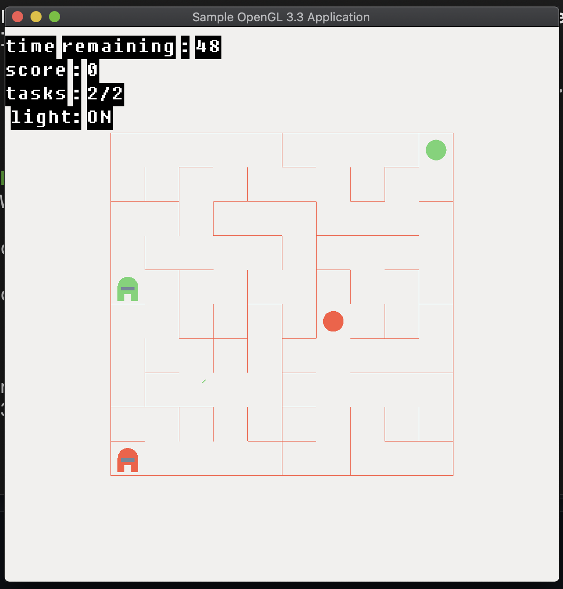
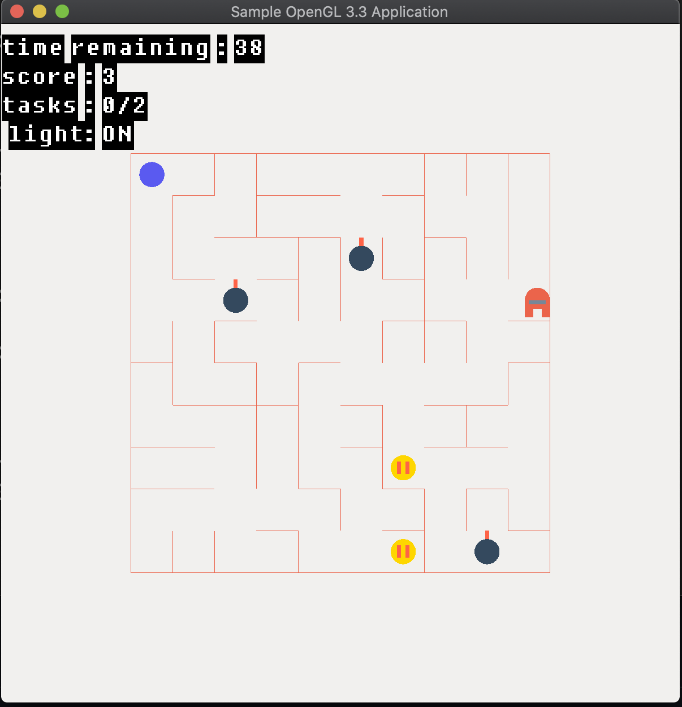

# About

This is a game where, in a randomly generated maze, you have to go from point A to point B. However there is a very smart green enemy that knows where you are and uses the shortest path algorithm to find you. You must either reach the destination before the enemy catches you, or kill the enemy before he catches you. You can kill the enemy by pressed a big green button.

# Installations
You will need to have glew, cmake, and glm on mac.

To do it on a mac simply run
```
brew install cmake
brew install glew
brew install glm
```

# Controls


- Use arrow keys to move your character.

- Avoid green imposter or you will die.

- Get green button to kill the green imposter.

- Get red button for coins and bombs. Collect coins to get points and avoid bombs if you don't want to die.


# How to run
```code
mkdir build
cd build
cmake ..
make
./Hello_World
```


# Screenshots



